# ERP Commerce Platform

A full-stack ERP + commerce system that simulates real-world retail and wholesale business operations, including inventory management, customer handling, billing, and order processing.

This project demonstrates end-to-end system design, backend architecture, and mobile-first business application development.

---

## 🎯 Purpose

The goal of this project is to showcase the ability to design and build a scalable ERP-style system that integrates core business operations into a unified workflow:

- Retail & wholesale operations
- Inventory control
- Customer and employee management
- Billing and invoice generation

---

## 🚀 Core Features

### 🛒 Commerce System
- Product management
- Shopping cart flow
- Order handling

### 👥 CRM (Customer Management)
- Create / Read / Update / Delete customers
- Customer tracking system

### 👨‍💼 Employee Management
- Employee CRUD operations
- Role-based structure (basic implementation)

### 📦 Inventory System
- Warehouse / storage management
- Stock tracking

### 🏭 Wholesale Module
- Bulk operations
- Wholesale workflow simulation

### 🧾 Billing System
- Invoice generation
- Order-to-billing logic

---

## 📸 System Overview (Screenshots)

### Admin Dashboard
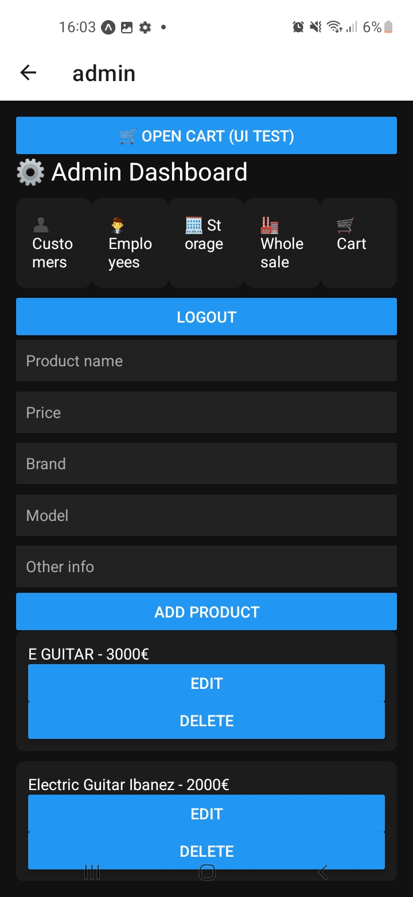
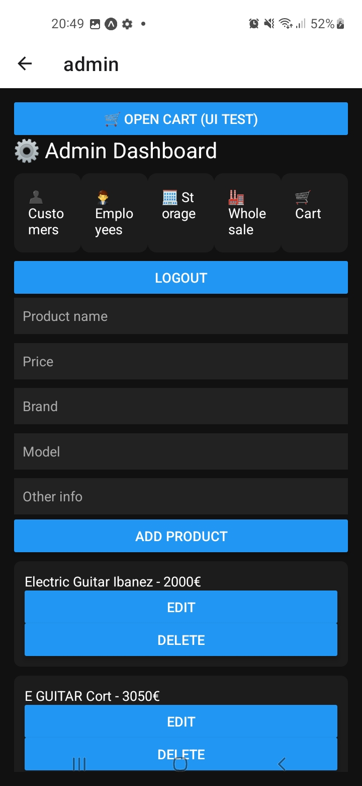

### Shopping & Cart Flow
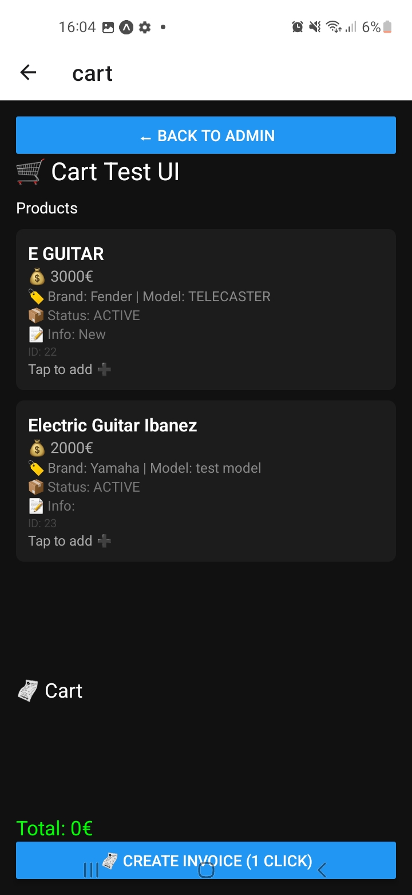
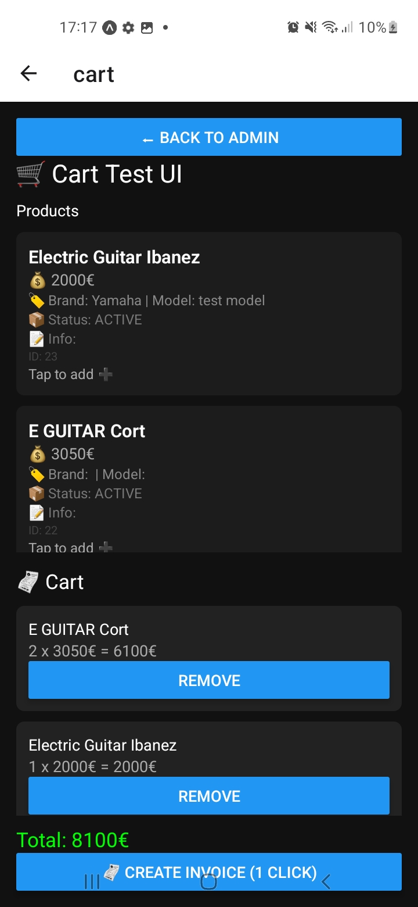

### Customer Management
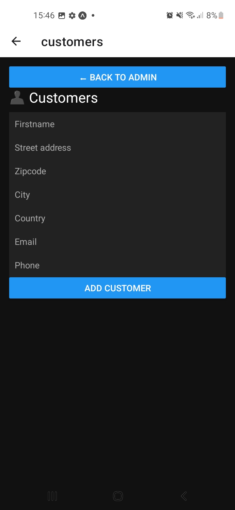

### Employee Management
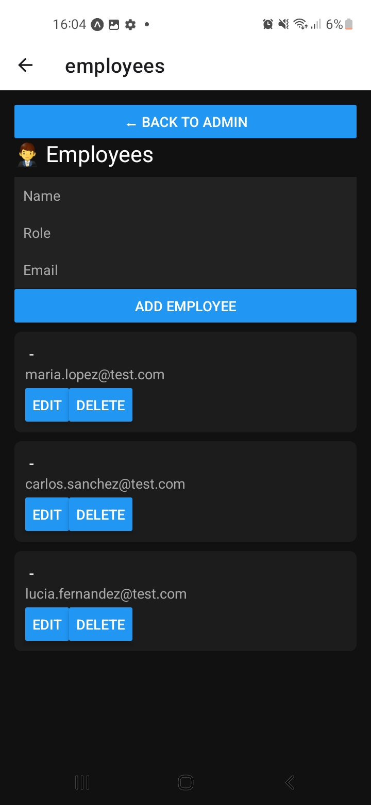

### Inventory / Warehouse
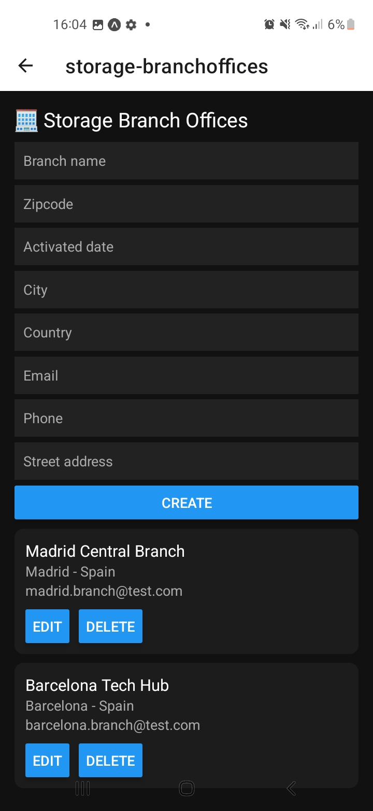
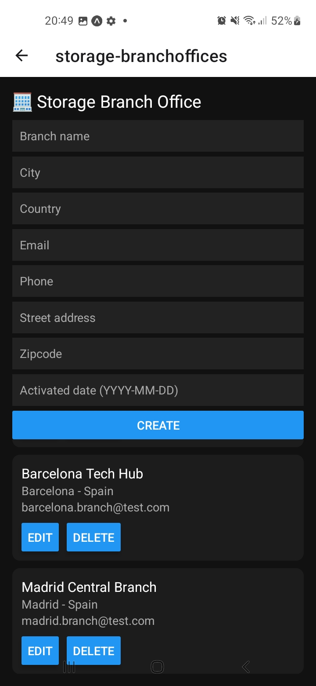

### Wholesale Operations
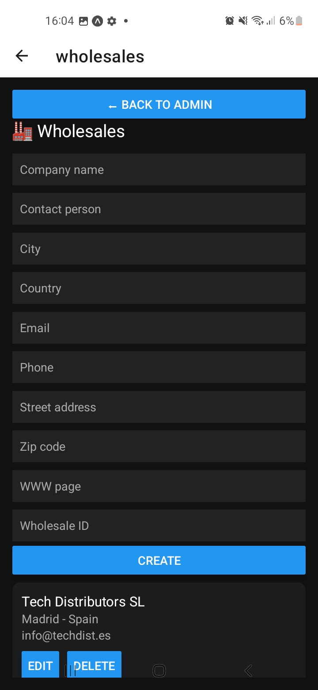

### Billing / Invoices
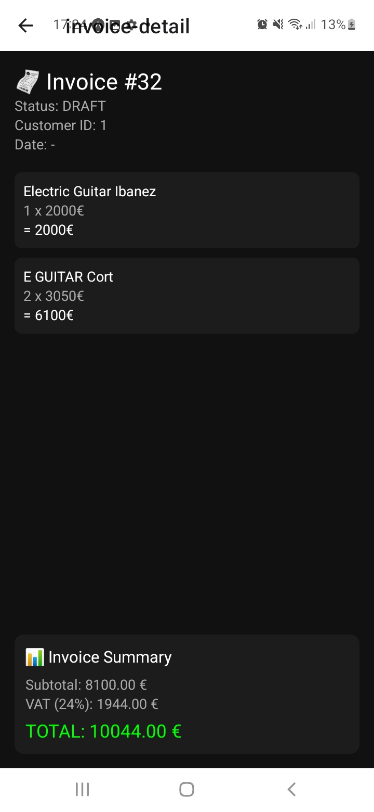

### System Entry
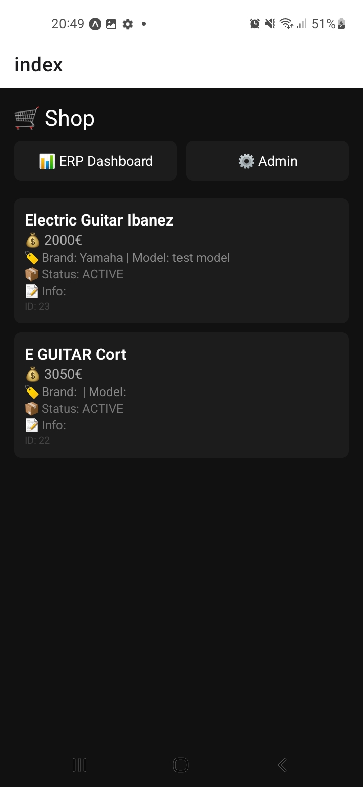

---

## 🧱 Tech Stack

- React Native (Mobile frontend)
- Node.js / Express (Backend API)
- Supabase (Database & backend services)

---

## 🏗️ Architecture

The system follows a modular architecture:

- **Backend layer** → Business logic, APIs, data handling
- **Mobile layer** → User interface for ERP operations
- **Database layer** → Managed via Supabase

---

## 📌 Project Status

Core ERP modules implemented and functional.  
Ongoing improvements focus on UI consistency, scalability, and optimization.

---

## 💡 Key Highlights

- Full ERP workflow simulation (not just CRUD demo)
- Multi-module business system architecture
- Realistic retail + wholesale scenario implementation
- Mobile-first ERP interface

---

## 👨‍💻 About This Project

This project was built as a full-stack portfolio system to demonstrate practical software engineering skills in business applications, including system design, backend integration, and mobile development.

---

## 📍 Notes

This is a learning + portfolio project, continuously evolving with additional modules and improvements.

